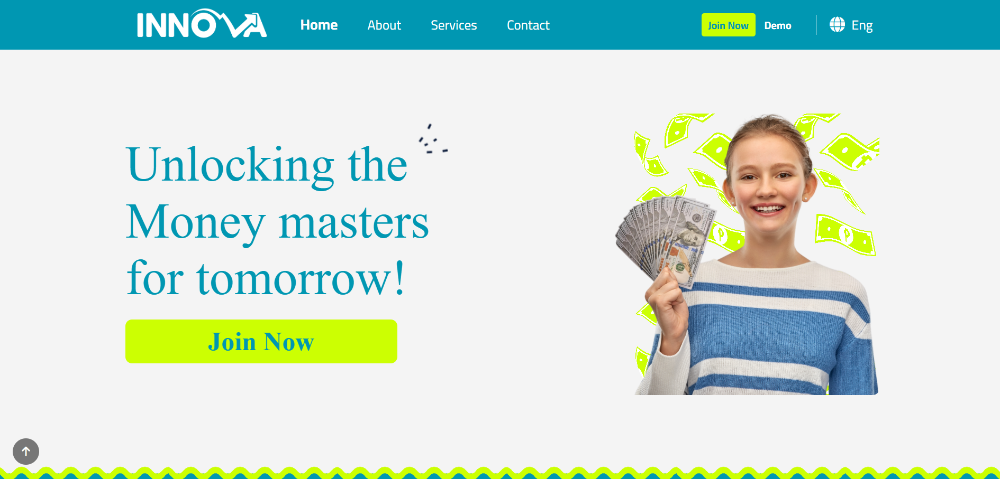

# Charity Arabic Web Template 🤲❤️
<div align="center">
A multi-page Arabic RTL charity website template built with HTML, CSS, and Bootstrap. Features a sticky navigation with social links, a full-screen hero, image gallery, testimonials, services, blog posts, and dedicated login and sign-up pages — integrated with ASP.NET Razor Pages.
<br>
<div align="center">
  <a href="https://tendopain18.github.io/charity-arabic-web-template/" target="_blank">
    
  </a>
</div>
<br>
<br>

[](https://tendopain18.github.io/charity-arabic-web-template/)

</div>

## 🎨 About The Project
Charity is a fully Arabic RTL multi-page website for a charitable organization. It is designed to connect donors and volunteers with the cause, presenting the organization's mission, photo gallery, donor testimonials, active projects, and latest news — all with a warm and inviting visual style. The project is structured as an ASP.NET Razor Pages application with standalone HTML pages for preview purposes.

## ✨ Features

- **Sticky RTL Header**: Fixed navigation bar with social media icons, login and sign-up links, and a hamburger menu
- **Full-Screen Hero**: Landing section with a background overlay and a centered donation call-to-action button
- **Features Section**: Three-column icon-based highlights covering volunteerism, giving, and donation
- **Image Gallery**: Responsive photo grid with hover caption overlay effect
- **Testimonials**: Three-column donor testimonial cards with avatar images and blockquotes
- **Services / Projects**: Six-column grid of charity project cards with heart icons
- **Blog Section**: Three-column latest news cards with cover images, dates, and comments
- **About Page**: Dedicated page describing the organization's mission and values with a side image
- **Contact Page**: Contact form with name, email, phone, and message fields alongside an embedded Google Maps iframe
- **Login Page**: Styled RTL login form with email and password fields
- **Sign-Up Page**: RTL registration form with first name, last name, email, password, phone, country, birthdate, and gender fields
- **Dark Footer**: Social icons, copyright notice, and attribution

## 🚀 Getting Started

1. **Clone the repository**
```bash
git clone https://github.com/TendoPain18/charity-arabic-web-template.git
```

2. **Open in browser**
```
Open index.html directly in any modern browser
```

No build tools or dependencies required.

## 🛠️ Built With

- **HTML5** — Semantic RTL markup
- **CSS3** — Custom properties, Flexbox, Bootstrap grid, media queries
- **Bootstrap** — Responsive layout and components
- **Font Awesome 4** — Icons
- **Google Fonts** — Open Sans & Poppins typefaces
- **jQuery / Owl Carousel** — Testimonial slider
- **Google Maps Embed** — Contact page map

## 📄 License
This project is licensed under the MIT License.

## 🙏 Acknowledgments

- Base template by [FreeHTML5.co](http://freehtml5.co)
- Icons by Font Awesome

<br>
<div align="center">
  <a href="https://tendopain18.github.io/charity-arabic-web-template/" target="_blank">
    
  </a>
</div>
<br>

<!-- CONTACT -->
<!-- END CONTACT -->
